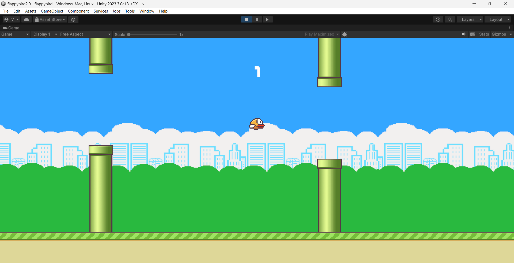

# FlappyBird2.0
# Unity Flappy Bird Recreation

Welcome to my Unity-based Flappy Bird game recreation! 🕹️🐦

## Overview

This project is a recreation of the classic Flappy Bird game using Unity, providing an immersive and enjoyable gaming experience. I've aimed to capture the essence of the original while leveraging the power and flexibility of Unity's game development capabilities.

## Features

- **Classic Gameplay:** Experience the iconic Flappy Bird gameplay within the Unity game engine.
- **Responsive Controls:** Enjoy precise and responsive controls for a seamless gaming experience.
- **Score Tracking:** Keep track of your high scores and challenge your friends to beat your flapping skills.
- **Music and Sound Effects:** Immerse yourself in the game with background music and interactive sound effects.

## How to Play

1. Clone the repository to your local machine.
2. Open the Unity project using Unity Editor.
3. Navigate to the `Scenes` folder and open the main game scene.
4. Press the play button in Unity Editor to launch the game.
5. Use the spacebar or a designated input to make the bird flap and navigate through the pipes.
6. Challenge yourself and aim for the highest score!

## Screenshots

## Technologies Used

- Unity 3D
- C#

## Contributing

Contributions are welcome! Feel free to submit bug reports, feature requests, or pull requests. Let's make this Unity Flappy Bird recreation even better together!

## Acknowledgments

- Thanks to Dong Nguyen for creating the original Flappy Bird game.

Enjoy the game, and happy flapping! 🚀
